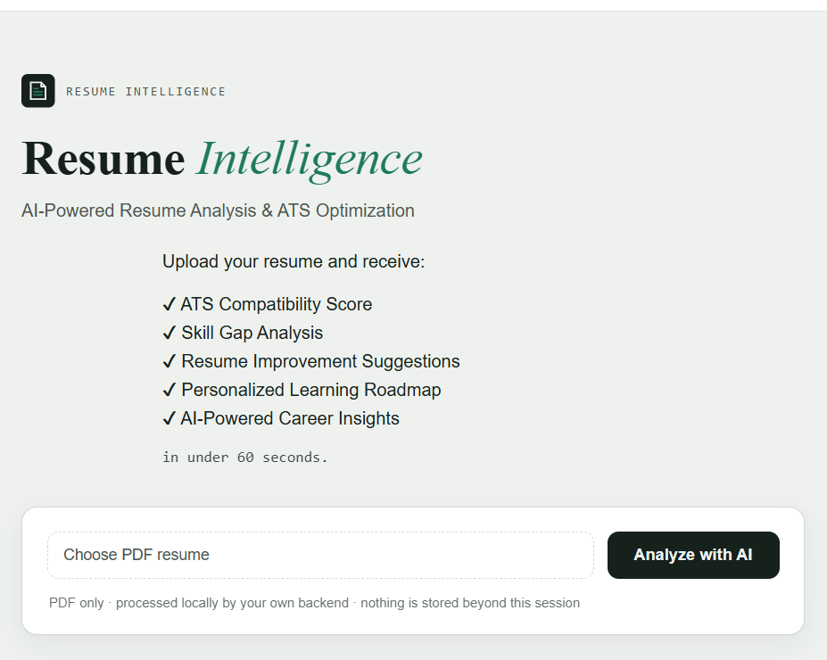
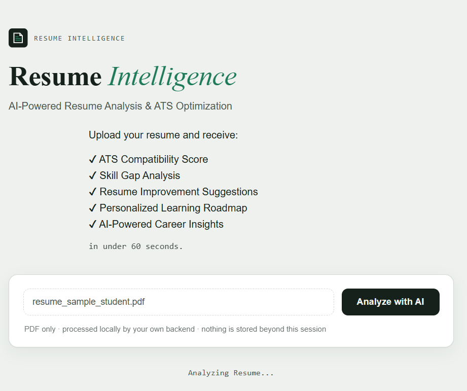
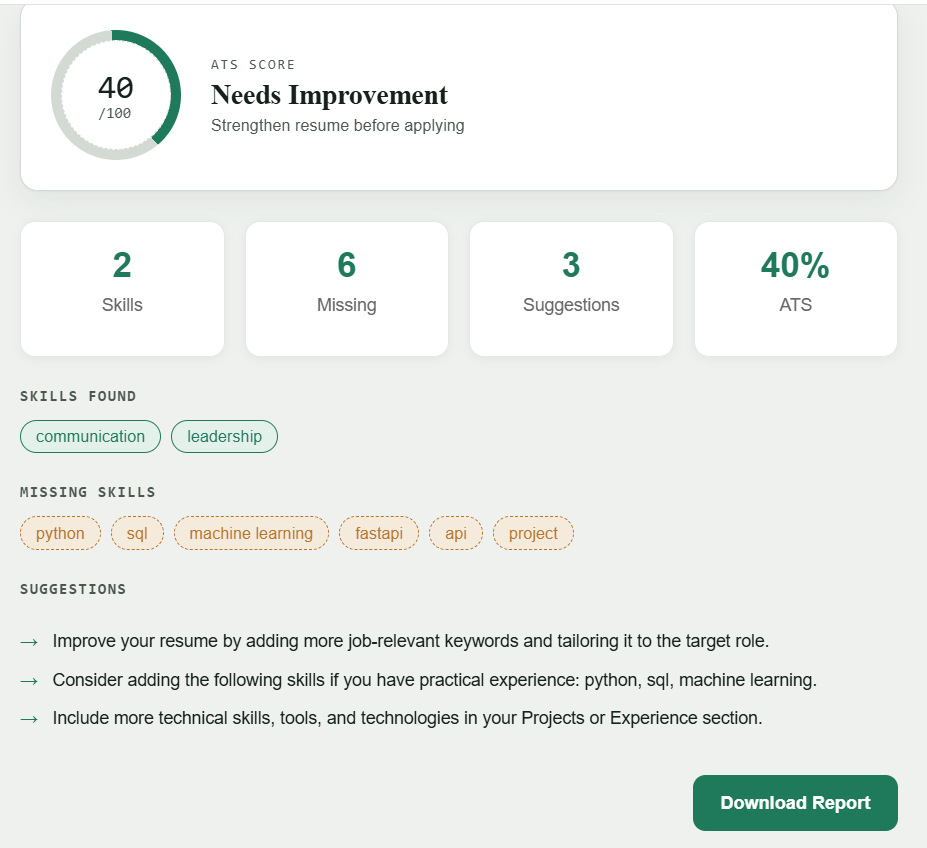

**Problem Statement: AI-powered Resume Intelligence & Career Guidance**

Resume-Intelligence is an intelligent resume analysis platform that transforms traditional resumes into actionable career insights using AI.

# 🚀 Resume-Intelligence = Intelligent Resume Analyzer

> AI-powered Resume Analyzer built with FastAPI, Gemini AI and Lemma. Generates ATS score, skill-gap analysis and personalized career recommendations from PDF resumes.


> **Upload a PDF resume and instantly receive an AI-generated ATS score, extracted skills, skill-gap analysis, resume improvement suggestions, interview questions, and personalized career recommendations.**

---


# 📖 Overview

Recruiters spend only a few seconds reviewing each resume.

**Resume-Intelligence** helps students and job seekers instantly understand how strong their resume is by generating an AI-powered analysis.

The system extracts resume content from a PDF, analyzes it using an AI agent, and produces an easy-to-understand report including:

- Professional Summary
- Skills Extraction
- ATS Evaluation
- Missing Skills
- Resume Improvement Suggestions
- Interview Questions
- Personalized Learning Roadmap

---

# ✨ Features

✅ Upload Resume (PDF)

✅ Automatic Text Extraction

✅ Resume Detection

✅ AI-Powered Resume Analysis

✅ ATS Score Calculation

✅ Technical & Soft Skill Extraction

✅ Missing Skill Detection

✅ Resume Improvement Suggestions

✅ Interview Question Generation

✅ Personalized Learning Roadmap

✅ FastAPI Backend

✅ Gemini AI Integration

✅ Lemma Agent Integration


## 📸 Screenshots

### Home Page



### Resume Upload & AI Analysis


### ATS Report



# 🏗️ Architecture Diagram


### Workflow

1. User uploads a resume through the frontend.
2. FastAPI backend receives the PDF.
3. PDF Reader extracts text from the uploaded resume.
4. ATS Engine calculates the ATS score and extracts skills.
5. Gemini AI Service generates detailed AI-powered resume analysis.
6. FastAPI combines all results into a JSON response.
7. The frontend displays the ATS score, extracted skills, missing skills, suggestions, interview questions, and AI analysis.


# 📂 Project Structure

```
Resume-Intelligence/
│
├── agents/
│   └── resume-intelligence-agent/
│       ├── resume-intelligence-agent.json
│       └── instruction.md
│
├── backend/
│   ├── __init__.py
│   ├── ats_engine.py
│   ├── gemini_service.py
│   ├── main.py
│   └── pdf_reader.py
│
├── frontend/
│   ├── index.html
│   ├── script.js
│   └── style.css
│
├── images/
├── LICENSE
├── README.md
├── requirements.txt
└── .gitignore

```

# ⚙ Installation

Clone the repository

```bash
git clone https://github.com/poonamsaini-123/Resume-Intelligence.git
```

Move into project

```bash
cd Resume-Intelligence
```

Install dependencies

```bash
pip install -r requirements.txt
```

Run backend

```bash
uvicorn backend.main:app --reload
```

Open frontend

```
frontend/index.html
```
# 📊 Sample Output

The API returns structured JSON similar to:

```json
{
  "filename": "resume.pdf",
  "analysis": {
    "analysis_raw": "...",
    "ats_score": 75,
    "skills": [
      "Python",
      "SQL",
      "Machine Learning"
    ],
    "missing_skills": [
      "Cloud",
      "System Design"
    ],
    "suggestions": [
      "Add measurable achievements",
      "Improve project descriptions"
    ]
  }
}
```

---

# 🎯 Use Cases

- Resume Evaluation
- Internship Preparation
- Campus Placements
- AI-powered Career Guidance
- ATS Readiness
- Skill Gap Analysis

# 💡 Future Improvements

- Resume comparison
- Resume Ranking
- Multiple Resume Upload
- LinkedIn Profile Analysis
- Dark Mode
- AI-powered Resume Rewrite
- Multi-language Resume Support
- Recruiter Dashboard


# 👩‍💻 Developed By

**Poonam Saini**

B.Tech CSE (AI/ML)

Rayat Bahra University

**GitHub:** <https://github.com/poonamsaini-123>

**LinkedIn:** <https://www.linkedin.com/in/poonam-saini-986058340>

---

# 🌟 Why Resume-Intelligence?

Unlike a simple PDF parser, Resume-Intelligence combines document processing with AI-powered reasoning to provide actionable career insights.

It not only extracts resume information but also helps users understand:

- What recruiters look for
- Which skills are missing
- How to improve the resume
- What interview questions to expect
- What to learn next

This transforms a static resume into an intelligent career guidance report.

---

## 🏆 Achievements

- Participated in the **Gappy AI Hackathon (July 2026)**.
- Built **Resume-Intelligence**, an AI-powered Resume Analyzer using Python, FastAPI, Gemini AI, and the Lemma AI platform.
- Received a **Certificate of Participation** from Gappy AI.

📄 **Certificate:**  
[View Certificate](assets/certificates/GappyAI_Hackathon_Certificate.pdf)

---

# 📄 License

This project is licensed under the MIT License.

